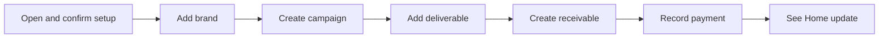

# UGC OS V1 — Scope and Screen Flow for Review

**Status: Product-owner decisions in section 9 accepted, 2026-09-17.** No prototype or product functionality is implemented by this document. Detailed implementation questions remain open where identified.

## 1. What we are proposing

Build UGC OS first: a customer-owned Google spreadsheet that helps an independent creator manage brand work, deadlines, rights, money, and time through polished HTML/CSS forms and guided actions.

Keep the code small and the experience fluid. Start with one complete working journey, then complete the documented UGC V1 capabilities before commercial release.

**Already decided:** Brazil first, `pt-BR`/BRL, one-time purchase with no planned paid upgrades, customer-owned data, CSV backup/restore, minimum permissions, and a maintained portfolio of future niches.

**Accepted in section 9:** UGC first with the stated V1 scope, the screen organization/guided flow, essential mobile actions at launch, and the financial meanings in section 6. Initial form details, prototype surface feasibility, and the explicitly listed implementation questions still need resolution. This document does not approve new Google scopes or settle mobile deployment.

**Joint guide/system validation:** write the relevant core Guia Rápido text alongside each workflow slice. The product owner reads that text while exercising the system; reconcile terminology, examples and behavior together. See the [guide workflow](../guides/README.md) and [UGC guide draft](../guides/ugc-guia-rapido.md).

## 2. Customer outcome and scope

The creator should be able to answer: What do I need to deliver? What is overdue? What am I owed? Which rights expire soon? What am I earning from this work relative to its expenses and time?

| Area | First working journey | Complete V1 before commercial release |
|---|---|---|
| Setup | Confirm basic settings; create first brand | Guided onboarding, help, visible version and setup state |
| Brands | Name and optional contact information | Edit details, notes, campaign history, safe archiving |
| Campaigns | Brand, campaign name, origin of opportunity, agreed fee, due date | Status management, associated deliverables and financial view; keep origin distinct from content usage channels |
| Deliverables | Type, description, due date | Revisions included/used, estimated/actual hours, status updates |
| Usage rights | Subsequent slice | Type, dates, territory/channels, renewal value and expiry attention |
| Money | Explicit receivable creation and payment recording | Partial payments, expenses, outstanding balances, campaign/client economics |
| Home | Due work and outstanding/received amounts | Overdue work, unpaid/overdue receivables, expiring rights and renewal attention |
| Data ownership | Stable records and installation/schema metadata | CSV export, validated restore/transfer, System Check and recovery guidance |
| Mobile | Select and validate delivery for the approved actions | Essential actions in section 5 required at launch |

The first journey is an engineering milestone, not a reduction of the existing V1 promise. Editing and recovery behavior must be defined alongside record creation, rather than left until customers encounter mistakes.

Outside V1: social analytics/posting, contract generation, fiscal invoicing, accounting/tax filing, default email automation, marketplace integrations, remote databases, and custom workflows for individual customers. File/media hosting is not proposed. “Receivable” means tracking money owed; a generated invoice document is not assumed.

## 3. Screen organization

Approved navigation: **Início · Campanhas · Marcas · Financeiro**, with **Ajuda e dados** available as a utility area. Portuguese labels below remain editable copy; implementation will use localization keys.

| Screen | What the user sees | Main action / next step |
|---|---|---|
| Welcome and setup | Plain-language permission explanation, locale/currency defaults, short setup checklist | Confirm settings → add first brand |
| Início | Four compact indicators, upcoming work, actionable attention list | Nova campanha; open the record needing attention |
| Campanhas | Searchable campaign list with brand, deadline and status | Create or open a campaign |
| Campaign detail | Campaign summary, deliverables, rights, money and hours, grouped into clear sections | Adicionar entrega; Registrar recebimento; Adicionar despesa |
| Marcas | Brand list and each brand's contact details/campaign history | Nova marca; open associated campaign |
| Financeiro | Receivables, received amounts and expenses, linked to their campaigns | Record a payment or expense; inspect outstanding balance |
| Ajuda e dados | Contextual help, versions, System Check, CSV export/restore guidance | Export data or diagnose a problem |

Deliverables and rights live primarily within campaign detail, with attention links from Home. They do not need separate top-level navigation in the first design.

**Surface proposal:** use a lightweight Sheets entry point/navigation sidebar and a larger HTML dialog for Home, campaign detail and longer forms. Test this arrangement in the actual Sheets environment before committing to it. Readable Sheets reports may supplement the guided interface; raw data tables remain system-managed. Desktop surface selection does not settle mobile delivery.

## 4. First user journey

This is the onboarding example, not a rule that payments must wait until delivery. A creator may record a deposit before finishing the work.

| Form/action | Proposed minimum input | Guidance and result |
|---|---|---|
| Add brand | Display name | Contact fields optional; save and return to the campaign form with the brand selected |
| Create campaign | Brand, origin of opportunity, name, agreed fee, due date | Explain the agreed total and that origin describes how the creator learned the job was available; save without silently creating a receivable |
| Add deliverable | Type, description, due date | Keep campaign context visible; reveal revision/hour details when useful |
| Create receivable | Campaign, description, amount, due date | Show agreed fee and existing receivables so the creator can check the amount |
| Record payment | Receivable, amount, date | Show outstanding balance; prefill it as an editable amount; confirm the remaining balance after save |
| Add expense | Description, category, amount, date; campaign where applicable | Link a campaign expense to its economics; keep general expenses distinguishable |
| Add usage right | Deliverable, type and dates; optional territory/channel notes and renewal value | Explain the expiry date; show the saved right and its attention state |

Dates/requiredness, free versus fixed deliverable types, and detailed correction behavior will be finalized in bounded implementation issues. Do not introduce additional mandatory contact, tax or address fields without a workflow reason.

Form behavior throughout:

- Start with the fields needed for the task; avoid a wizard when one short form is sufficient.
- Use a clear primary action, visible labels, sensible defaults and keyboard-friendly controls.
- Place validation beside the relevant field and retain entered values after failure.
- Show saving/saved/error feedback; prevent repeated clicks from creating duplicate records.
- State whether data was saved. An uncertain response needs a safe way to verify the outcome before retrying.
- Warn before discarding unsaved edits; cancellation creates no business records.
- Empty states explain the first useful action, such as “Crie sua primeira campanha.”

## 5. Approved mobile launch requirement

**Approved in section 9:** mobile quick actions are required for UGC's first commercial release. This is a product-owner scope decision; external customer validation is still pending.

| Mobile task | Proposed priority | Validation question |
|---|---|---|
| View upcoming/overdue deliverables and campaign details | Required at launch | Can the creator find today's work without a computer? |
| Update deliverable status and actual hours | Required at launch | Can the creator record progress immediately after doing the work? |
| Record a payment or expense | Required at launch | Can they capture it accurately when it happens? |
| Create full campaigns, configure rights, analyze reports, restore backups | Desktop baseline | Can these reasonably wait for desktop use? |

Choose and test a supported delivery/auth approach before the relevant implementation. Reuse the same data and services; do not assume the desktop Sheets interface will be available on mobile. Require an actual phone test for each essential action. Offline operation is not included in this scope.

The manifest records this launch requirement. Delivery/auth architecture and device-test evidence remain open; approval of mobile scope is not evidence that mobile works yet.

## 6. Dashboard proposal and accepted money definitions

Proposed Home indicators: **Entregas nos próximos 7 dias**, **A receber**, **Recebido neste mês**, and **Direitos a vencer em 30 dias**. Upcoming-delivery and expiry windows are proposed defaults. Overdue work and overdue balances remain visible in the attention list even when outside those windows. Rights indicators arrive with the rights slice.

Every indicator must display its time basis. Campaign/client economics belong in their detailed views so Home remains focused.

Money policies accepted through the financial-meaning verdict in section 9:

- Keep agreed campaign value, receivables and actual receipts distinct; adding a payment does not create additional revenue.
- Permit partial payments; reject payments greater than the selected receivable's balance. Credits/refunds require a defined correction policy before implementation, not a silent workaround.
- Show **campaign contribution** as agreed fee minus recorded campaign expenses, explicitly noting that this excludes unallocated expenses and the creator's own labor cost.
- Show **gross effective revenue per hour** as agreed fee divided by total actual deliverable hours, with a completeness note. Zero hours produces “not available,” never zero or infinity.
- Use cent-precision money inputs and half-up rounding for displayed calculated monetary metrics; use unrounded values until the final calculation step. Define and test the actual numerical representation in implementation.

Deterministic sample, using those accepted definitions:

| Input/output | Expected value |
|---|---|
| Agreed campaign fee and one receivable | R$ 1.200,00 each; not R$ 2.400,00 revenue |
| Payment recorded | R$ 400,00 |
| Outstanding receivable | R$ 800,00 |
| Campaign expenses | R$ 150,00 |
| Campaign contribution | R$ 1.050,00 |
| Actual deliverable hours | 6 |
| Gross effective revenue per hour | R$ 200,00/h |
| Attempted additional payment of R$ 801,00 | Rejected; balance and saved payments unchanged |

The labels and calculation bases above were agreed in section 9. Before implementation, still define status transitions, cancellation, editing recorded financial data, receivable totals versus agreed fees, date/timezone boundaries, and treatment of undated/perpetual rights. These are necessary workflow policies, not assumed additional features.

## 7. Prototype and implementation sequence

| Step | Deliverable | Evidence needed to move forward |
|---|---|---|
| A. Review this brief | First product, scope, mobile needs and money definitions accepted | Decisions recorded in section 9 and canonical specs/ADR |
| B. UX prototype | Home, campaign detail, guided campaign/payment forms using synthetic sample data | Review in the intended Sheets surface; test empty, invalid, saving, success and failure states |
| C. First working journey | Setup → brand → campaign → deliverable → receivable → payment → Home | Real persistence; validation, stable IDs, localized fields, safe writes and initial diagnostics |
| D. Complete UGC V1 | Rights/renewal attention, revisions/hours, expenses, economics and record maintenance | Product acceptance scenarios pass; approved mobile actions work |
| E. Ownership and pilot readiness | CSV export/restore, corrected-workbook transfer, System Check, onboarding/help | Round-trip data preservation and failure/retry checks pass before a customer-data pilot |
| F. Small creator pilot | Observe 5–10 creators where practical; record friction and missing workflow needs | Fix launch-blocking issues; use evidence to refine UGC and portfolio priorities |

The prototype should use the marine/grey/silver palette and actual draft `pt-BR` copy, with empty and populated examples. It is not a separate product or a commitment to a frontend framework. Synthetic example: “Marca Exemplo,” one campaign, two deliverables, one receivable and a partial payment. Add synthetic overdue and expiring-right examples to evaluate attention states.

Do not create all shared modules first. Implement only the structures this journey needs. No new integration, broad Google permission, persistent entity, or deployment approach is approved by the prototype plan.

For steps B–E, deliver the corresponding core guide section and a small scenario with expected outcomes alongside the system changes. Use the same synthetic campaign and amounts in the guide, fixtures, and review script. Record both the system-test result and the product owner's guide/usability feedback; neither implies the other has passed. The complete publication does not need to be finished before development proceeds.

## 8. Acceptance and release safeguards

- **Guidance:** a reviewer can complete the first journey without editing raw tables or needing an explanation of system IDs.
- **Visual quality:** hierarchy, labels and actions are readable; forms retain context and fit the intended surface; responsive variants remain usable.
- **Correctness:** domain/service/adapter tests cover the approved calculation examples, broken references, missing fields and safe retries. Define status and correction tests with their policies.
- **Localization:** `pt-BR` dates, decimal entry and currency display work; user-facing text comes from message keys.
- **Responsiveness:** capture interaction timings on an agreed representative dataset during the prototype/first slice and set explicit acceptance limits before the pilot. No latency claim is established yet.
- **Mobile:** validate the approved launch-required actions on the chosen real surface, including failure/save feedback.
- **Ownership:** export canonical tables and required metadata/configuration to CSV; restore into a compatible/corrected workbook with unchanged IDs, relationships, archived data and historical values. Retain the source until verified.
- **Recovery:** reject incomplete/incompatible imports clearly; validate counts and relationships; test interrupted/retried operations and avoid silent merging into existing data.
- **Support:** make versions and System Check accessible; diagnostics avoid private business data; permissions and recovery steps are explained plainly.
- **Guide alignment:** the slice's core guide text, terminology, worked example and system behavior agree; owner review status is recorded separately from automated test status.

## 9. Product-owner review

The product owner recorded the following verdicts. Detailed technical choices remain in implementation issues.

| Decision | Recommendation | Review status |
|---|---|---|
| First product and scope | UGC first, with the complete V1 scope in section 2 |  Agreed|
| Screens and guided flow | Four main destinations, campaign-centered work, utility area for help/data |  Agreed|
| Mobile for UGC launch | Validate the essential candidate tasks in section 5 as a launch requirement | Approved |
| Financial meaning | Distinct agreed/owed/received amounts; contribution and gross hourly revenue as in section 6 | Agreed  |

Next work: prepare bounded prototype/implementation issues with acceptance criteria and paired Guia Rápido sections. Keep all other niches visible in the [portfolio roadmap](../roadmap/product-portfolio.md); this brief does not reprioritize them.

## References

- [UGC product specification](ugc-os.md) and [product manifest](../../products/ugc/manifest.yaml)
- [Architecture](../architecture/architecture-spec.md), [data dictionary](../architecture/data-dictionary.md), and [interface contracts](../architecture/interface-contracts.md)
- [UX standard](../architecture/ux-standard.md) and [localization standard](../architecture/localization-standard.md)
- [Versioning, CSV backup and migration](../architecture/versioning-and-migrations.md)
- [Test and acceptance standard](../quality/test-and-acceptance-spec.md) and [support/feedback](../operations/support-and-feedback.md)
- [Development plan](../roadmap/development-plan.md)
